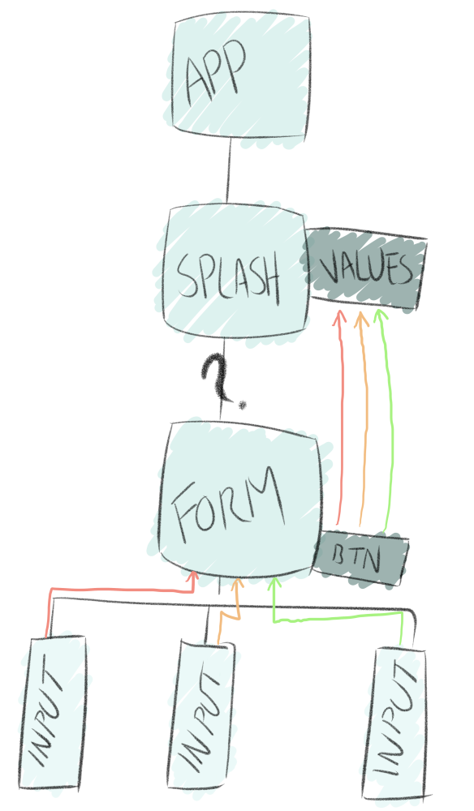

# React Form Submit Example

If we want to use values in a component that are entered in another, we can utilize hooks and props.

In this example, we're storing and displaying the values in the Splash component, but retrieving them from the user in the Form component--which, itself, retrieves information from InputFields.

If the form has been submitted, Splash won't show the Form component anymore. Instead, it'll just display the information submitted.

This is all done using props and hooks.

You can read through the comments to understand how.